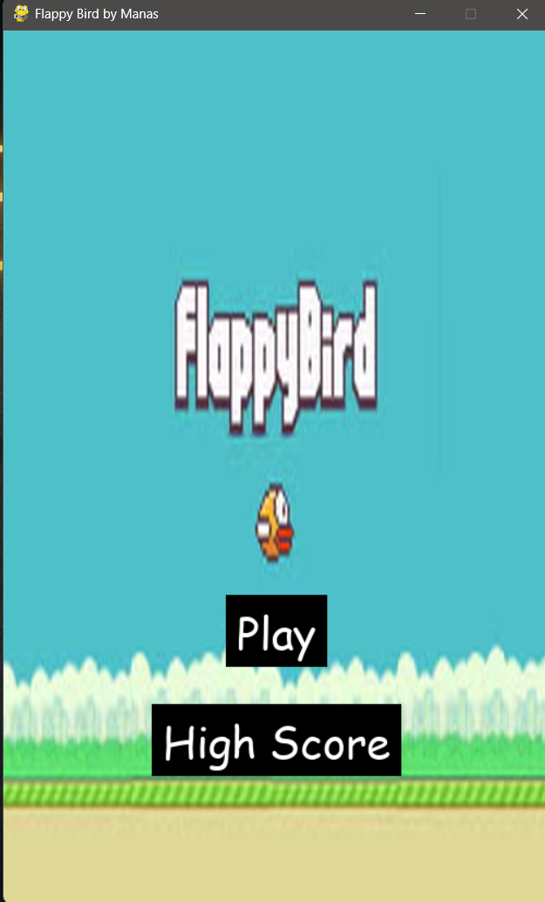
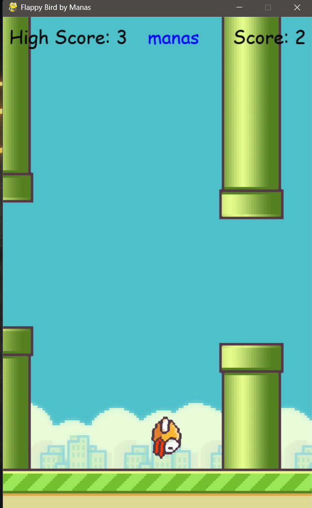
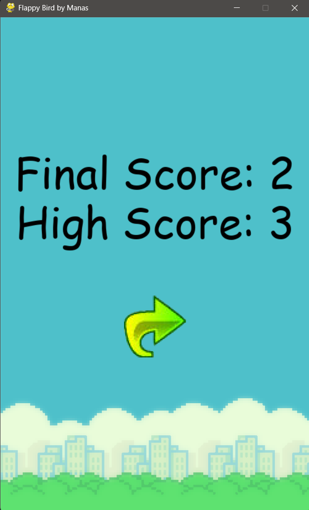

# 🐦 Flappy Bird Game (Python + Pygame)


---

## 📌 Overview

This project is a **Flappy Bird clone** built using **Python and Pygame**.
It features smooth gameplay, sound effects, a homepage UI, and a persistent high-score system.

👉 The game is also packaged as a **Windows installer (.exe)**, making it easy for anyone to install and play.

---

## 🎮 Features

* 🐦 Animated bird with smooth physics
* 🧱 Dynamic pipe generation
* 🔊 Sound effects (jump, hit, score, game over)
* 🏠 Homepage with Play & High Score menu
* 👤 Player name input system
* 🏆 High score leaderboard (JSON-based)
* 🔁 Retry functionality
* 💾 Persistent data storage
* 💻 Packaged as EXE using PyInstaller
* 📦 Installer created using Inno Setup

---

## 🖼️ Screenshots

> Add your screenshots inside a `screenshots/` folder and update paths below

### 🏠 Homepage



### 🎮 Gameplay



### 💀 Game Over



### 🏆 High Scores


---

## 📂 Project Structure

```
flappy_bird/
│
├── main.py
├── assets/
│   ├── images/
│   └── sounds/
├── icon/
│   └── icon.ico
├── .gitignore
```

---

## ▶️ Run Locally

```bash
pip install pygame
python main.py
```

---

## 💻 Download & Play

👉 Download the game from **Releases**:
➡️ https://github.com/manasomer0902/Flappy-Bird-Python/releases

* Download `FlappyBirdSetup.exe`
* Install the game
* Play 🎮

---

## 🧠 What I Learned

* Game development using Pygame
* Collision detection & game physics
* File handling using JSON
* Managing assets (images & sounds)
* Packaging Python apps with PyInstaller
* Creating installers using Inno Setup
* Debugging real-world issues (file paths, permissions)

---

## 📌 Author

**Manas Omer**

---

## ⭐ Show Your Support

If you like this project, consider giving it a ⭐ on GitHub!
